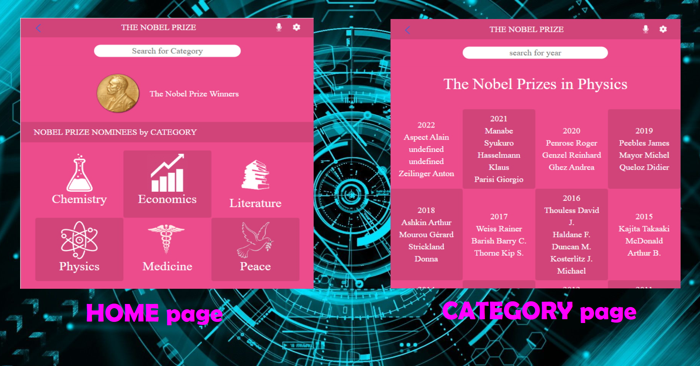

# Nobel-Prize

# 📗 Table of Contents

- [Space Travelers' Hub](#Space-Travelers-Hub)
- [📗 Table of Contents](#-table-of-contents)
- [📖 Space Travelers' Hub ](#-Space-Travelers-Hub-)
  - [🛠 Built With ](#-built-with-)
    - [Tech Stack ](#tech-stack-)
    - [Key Features ](#key-features-)
  - [Deployment Link:](#deployment-link)
  - [💻 Getting Started with Create React App ](#-getting-started-with-create-react-app-)
  - [Available Scripts](#available-scripts)
    - [`npm start`](#npm-start)
    - [`npm test`](#npm-test)
    - [`npm run build`](#npm-run-build)
  - [👥 Author ](#-author-)
  - [🔭 Future Features ](#-future-features-)
  - [🤝 Contributing ](#-contributing-)
  - [⭐️ Show your support ](#️-show-your-support-)
  - [🙏 Acknowledgments ](#-acknowledgments-)
    - [📝 License](#-license)

<!-- PROJECT DESCRIPTION -->

# 📖 Nobel-Prize 

**Nobel-Prize** The App is a simple website that shows the Laureates of The Nobel Prize over the course of years. The user can search for the Category and for the year to find the Laureates of that year.

## 🛠 Built With 

### Tech Stack 

> Describe the tech stack and include only the relevant sections that apply to your project.

  
Programming languages

  <ul>
    <li><a href="https://developer.mozilla.org/en-US/docs/Web/CSS">CSS</a></li>
    <li><a href="https://www.javascript.com/">JavaScript</a></li>
    <li><a href="https://reactjs.org/">React</a></li>
    <li><a href="https://redux.js.org/">Redux</a></li>
  </ul>
 

 

  
Technologies

  <ul>
    <li><a href="https://git-scm.com/">Git</a></li>
    <li><a href="https://github.com/">Github</a></li>
    <li><a href="https://eslint.org/">Linters</a></li>
    <li><a href="https://www.atlassian.com/git/tutorials/comparing-workflows/gitflow-workflow">Gitflow</a></li>
  </ul>
 

 

  
Frameworks

  <ul>
    <li><a href="https://getbootstrap.com/">Bootstrap 5</a></li>
  </ul>
 

  
Modules

  <ul>
    <li><a href="https://es6.io/">ES6</a></li>
  </ul>
 

  
Server

Database

### Key Features 

- The home page shows the categories
- If the user goes inside the category it shows the list of Laureates by year
- The user can search for the category in home page
- The user can search for the year in category page

(<a href="#readme-top">back to top</a>)

## Live Demo:

[nobel-prize.com](https://stalwart-meerkat-31f5be.netlify.app/)

[Loom.video](https://www.loom.com/share/812536f9e2d74d5b89d9a7cfb4cd85af)

## 💻 Getting Started with Create React App 

This project was bootstrapped with [Create React App](https://github.com/facebook/create-react-app).

To get a local copy up and running, follow these steps.

### Prerequisites

- Install git in your computer.
- Install a code editor.
- And web browser to view the output.

### Setup

Clone this repository to your desired folder:

- `cd my-folder`
- `git clone https://github.com/haliljon/Nobel-Prize.git`

### Install

Navigate to directory with `cd nobel-prize`

- Run `npm install` to install the dependencies.

## Available Scripts

In the project directory, you can run:

### `npm start`

Runs the app in the development mode.\
Open [http://localhost:3000](http://localhost:3000) to view it in your browser.

The page will reload when you make changes.\
You may also see any lint errors in the console.

### `npm test`

Launches the test runner in the interactive watch mode.\
See the section about [running tests](https://facebook.github.io/create-react-app/docs/running-tests) for more information.

### `npm run build`

Builds the app for production to the `build` folder.\
It correctly bundles React in production mode and optimizes the build for the best performance.

The build is minified and the filenames include the hashes.\
Your app is ready to be deployed!

See the section about [deployment](https://facebook.github.io/create-react-app/docs/deployment) for more information.

## 👥 Authors 

👤 **Haliljon Juraboev**

- GitHub: [@githubhaliljon](https://github.com/haliljon)
- Twitter: [@twitterhaliljon1](https://twitter.com/haliljon1)
- LinkedIn: [LinkedIn](https://www.linkedin.com/in/juraboev-haliljon)

👤 **George M'sapenda**

- GitHub: [@github](https://github.com/c00p75)
- LinkedIn: [LinkedIn](https://www.linkedin.com/in/georgemsapenda/)

(<a href="#readme-top">back to top</a>)

FUTURE FEATURES

## 🔭 Future Features 

>

- [ ] **[I would like to improve the look and feel of the application]**

(<a href="#readme-top">back to top</a>)

## 🤝 Contributing 

Contributions, issues, and feature requests are welcome!

Feel free to check the [issues page](https://github.com/haliljon/nobel-prize/issues).

(<a href="#readme-top">back to top</a>)

## ⭐️ Show your support 

Please consider giving a ⭐️ if you like this project!

(<a href="#readme-top">back to top</a>)

## 🙏 Acknowledgments 

> Give credit to everyone who inspired your codebase.

We would like to thank [Nelson Sakwa](https://www.behance.net/sakwadesignstudio), [Microverse](https://www.microverse.org/)

P.S. stackoverflow and google 😉

(<a href="#readme-top">back to top</a>)

### 📝 License

- This project is [MIT](./LICENSE) lincensed.

(<a href="#readme-top">back to top</a>)

